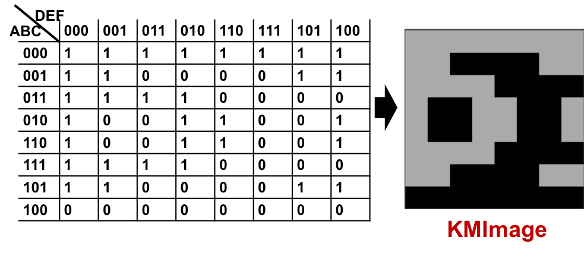

Deep Learning Network Classifier
=======================================

A Deep Neural Network (DNN) is used to determine the best-fit algorithm to optimize a partition. Image representations of a karnaugh-map are used (KM-Image) to model the logic network's functionality in the 2D space. An example of a KM-Image of a 6-input logic cone is shown below.

The DNN model was based primarily on a solution to the MNIST handwriting problem because the input for both applications are simple grayscale images and there are very few classes (10 in MNIST and 2 in this application). The topology is shown below.

.. image:: figures/dnn_top.png
		:width: 600

Combinational networks from the EPFL and ISCAS85 benchmark suites were partitioned into smaller sub-circuits, and the logic cones from these sub-circuits were optimized using both AIG and MIG methods in order to create the training dataset. The best optimization method was determined which reduced the area of the cone the most. We used this metric because it resulted in a relatively balanced dataset. After training with this dataset, the overall accuracy achieved with this model was 79% with similar accuracy for each of the classes meaning that the model is not biased to one method over the other.
